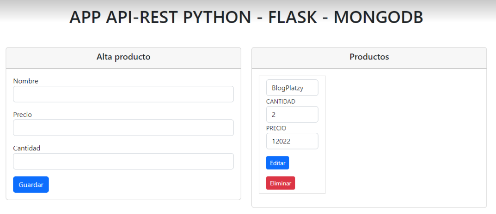
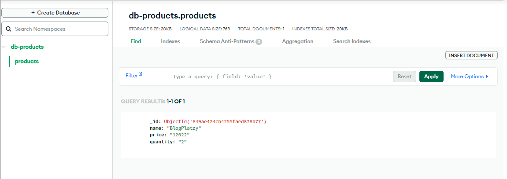

## Crud con flask y mongodb





## Requisitos previos

* python instalado: [python](https://www.python.org/downloads/)
* pip instalado: [pip](https://pip.pypa.io/en/stable/installing/)
* Cuenta en [MongoDB](https://www.mongodb.com/)


## Pasos a seguir

```sh
# Clonar el repositorio
git clone https://github.com/Jhonatan2022/Cruds-Multi-languages.git
```

```sh
# Accedemos al la carpeta del proyecto
cd .\Graficos-Dinamicos-Django\
```
```sh
# Instalamos virtualenv si no lo tenemos 
pip install virtualenv
```

```sh
# Damos los permisos necesarios por powershell
Set-ExecutionPolicy RemoteSigned
```

```sh
# Creamos un entorno virtual
virtualenv env
```

```sh
# Activamos el entorno virtual
.\env\Scripts\activate
```

```sh
# Instalamos los requerimientos
pip install -r requirements.sh
```

```sh
# Corremos el proyecto
python .\app\app.py
```

```sh
# Accedemos a la ruta donde se encuentra el proyecto
http://127.0.0.1:8000/
```
