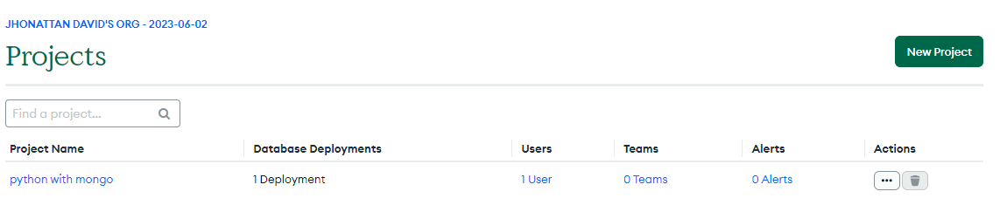

## Crud con flask y mongodb

## Creacion de base de datos (Cluster)

- Crear una cuenta en [MongoDB](https://www.mongodb.com/cloud/atlas/register)

1. Creamos un nuevo proyecto y le damos un nombre



2. Creamos un nuevo cluster y seleccionamos la opcion gratuita (M0) y la region que nos quede mas cerca


3. Creamos un usuario y contraseña para la base de datos (guardarlos en un lugar seguro)


3. Indicamos nuestra IP actual para que nos permita conectarnos a la base de datos y si queremos agregamos IP para que otras personas puedan conectarse a la base de datos


4. Damos click en `Connect` y seleccionamos la opcion `Connect your application`


## Requisitos previos

- python instalado: [python](https://www.python.org/downloads/)
- pip instalado: [pip](https://pip.pypa.io/en/stable/installing/)
- Cuenta en [MongoDB](https://www.mongodb.com/)

## Pasos a seguir

```sh
# Clonar el repositorio
git clone https://github.com/Jhonatan2022/Cruds-Multi-languages.git
```

```sh
# Accedemos al la carpeta del proyecto
cd .\Graficos-Dinamicos-Django\
```

```sh
# Instalamos virtualenv si no lo tenemos
pip install virtualenv
```

```sh
# Damos los permisos necesarios por powershell
Set-ExecutionPolicy RemoteSigned
```

```sh
# Creamos un entorno virtual
virtualenv env
```

```sh
# Activamos el entorno virtual
.\env\Scripts\activate
```

```sh
# Instalamos los requerimientos
pip install -r requirements.sh
```

```sh
# Corremos el proyecto
python .\app\app.py
```

```sh
# Accedemos a la ruta donde se encuentra el proyecto
http://127.0.0.1:8000/
```
